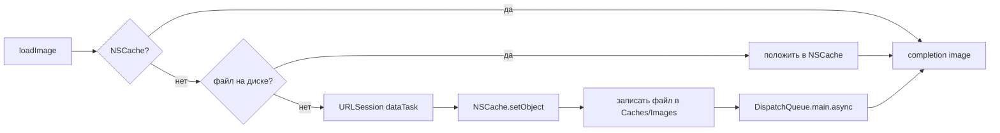

# Crypto Market App

Нативное iOS-приложение для просмотра рынка криптовалют: топ монет по капитализации, детальная карточка монеты и локальный список «Избранное».

Написано на **UIKit + Swift** полностью в коде (**без Storyboard**, без сторонних зависимостей). Данные берутся из публичного API **CoinGecko**, избранное хранится в **Core Data**, иконки монет кэшируются собственным двухуровневым загрузчиком (память + диск).

---

## Содержание

- [Возможности](#возможности)
- [Технологический стек](#технологический-стек)
- [Архитектура](#архитектура)
- [Структура проекта](#структура-проекта)
- [Подробный разбор модулей](#подробный-разбор-модулей)
  - [Слой данных: `Coin` и `CoinsModel.swift`](#слой-данных-coin-и-coinsmodelswift)
  - [`MainScreenViewModel` — сеть, пагинация, состояния](#mainscreenviewmodel--сеть-пагинация-состояния)
  - [`ViewController` — главный экран](#viewcontroller--главный-экран)
  - [`TableViewCell` — ячейка списка](#tableviewcell--ячейка-списка)
  - [`DetailViewController` — карточка монеты](#detailviewcontroller--карточка-монеты)
  - [`FavoritesViewController` — избранное](#favoritesviewcontroller--избранное)
  - [`ImageLoader` — двухуровневый кэш изображений](#imageloader--двухуровневый-кэш-изображений)
  - [Core Data: `CDCoins`](#core-data-cdcoins)
  - [`AppDelegate` / `SceneDelegate` — жизненный цикл](#appdelegate--scenedelegate--жизненный-цикл)
  - [`LabelBackgroundView` — компонент капитализации](#labelbackgroundview--компонент-капитализации)
- [Используемое API](#используемое-api)
- [Пользовательские сценарии](#пользовательские-сценарии)
- [Запуск проекта](#запуск-проекта)
- [Конфигурация сборки](#конфигурация-сборки)
- [Известные ограничения и технический долг](#известные-ограничения-и-технический-долг)
- [Дорожная карта](#дорожная-карта)
- [История разработки](#история-разработки)
- [Лицензия](#лицензия)

---

## Возможности

| Функция | Описание | Реализация |
|---|---|---|
| Список монет | Топ криптовалют, отсортированных по рыночной капитализации | `ViewController` + `UITableView` |
| Бесконечная прокрутка | Подгрузка следующей страницы за 5 строк до конца списка | `willDisplay` + `MainScreenViewModel.fetchNextPage` |
| Pull-to-Refresh | Полный сброс состояния и перезагрузка первой страницы | `UIRefreshControl` + `viewModel.reset()` |
| Индикация загрузки и ошибок | Футер таблицы показывает «Загрузка…» или текст ошибки | `footerLabel` + `ViewState` |
| Повтор запроса по тапу | При ошибке футер становится кнопкой повтора | `UITapGestureRecognizer` |
| Цветовая индикация | Изменение цены за 24 ч: зелёное / красное | `TableViewCell.configure` |
| Иконки монет | Загрузка по URL с кэшированием в RAM и на диске | `ImageLoader` |
| Детальная карточка | Иконка, имя, тикер, цена, ±24 ч, капитализация | `DetailViewController` |
| Сокращение больших чисел | `1_250_000_000 → 1.25B` | `Double.abbreviated` |
| Избранное | Сохранение монеты локально, просмотр офлайн | Core Data (`CDCoins`) |
| Удаление свайпом | Удаление монеты из избранного | `commit editingStyle: .delete` |
| Отмена «зависших» запросов | Старый `URLSessionDataTask` отменяется при refresh | `currentTask?.cancel()` |

---

## Технологический стек

- **Язык:** Swift (в исходниках используются возможности Swift 6: `public import`, строковая интерполяция `\(optional, default: ...)`)
- **UI:** UIKit, вёрстка кодом через `NSLayoutConstraint` / Auto Layout. Storyboard удалён (см. коммит `ab38b05`), остался только `LaunchScreen.storyboard`
- **Сеть:** `URLSession.shared.dataTask`, ручная сборка URL, `JSONDecoder`
- **Хранение:** Core Data (`NSPersistentContainer`, модель `Crypto_Market_App.xcdatamodeld`)
- **Кэш изображений:** `NSCache` (память) + `FileManager` в `.cachesDirectory` (диск)
- **Многозадачность:** `DispatchQueue.main.async` для возврата на главный поток
- **Зависимости:** отсутствуют — ни CocoaPods, ни SPM, ни Carthage

---

## Архитектура

Проект построен по упрощённому **MVVM** 

**Ключевая идея потока данных на главном экране** — конечный автомат `ViewState`:

```swift
enum ViewState {
    case idle
    case loading
    case loaded([Coin])
    case error(String)
}
```

ViewModel не знает про UIKit — она отдаёт состояние в замыкание, а `ViewController.handle(_:isFirstPage:)` решает, что отрисовать. Это позволяет тестировать логику пагинации отдельно от UI.

---

## Подробный разбор модулей

### Слой данных: `Coin` и `CoinsModel.swift`

```swift
struct Coin: Codable, Identifiable {
    var id: String
    var symbol: String
    var name: String
    var image: String
    var currentPrice: Double
    var marketCap: Double?
    var marketCapRank: Int?
    var priceChangePercentage24h: Double?
}
```

| Свойство | Тип | JSON-ключ | Обязательное |
|---|---|---|---|
| `id` | `String` | `id` | да |
| `symbol` | `String` | `symbol` | да |
| `name` | `String` | `name` | да |
| `image` | `String` (URL) | `image` | да |
| `currentPrice` | `Double` | `current_price` | да |
| `marketCap` | `Double?` | `market_cap` | нет |
| `marketCapRank` | `Int?` | `market_cap_rank` | нет |
| `priceChangePercentage24h` | `Double?` | `price_change_percentage_24h` | нет |

Маппинг snake_case → camelCase выполнен явно через `CodingKeys` (альтернатива — `keyDecodingStrategy = .convertFromSnakeCase`). Опциональность у `marketCap`, `marketCapRank` и изменения цены выбрана осознанно: у малоликвидных монет CoinGecko отдаёт `null`, и без опционалов декодирование всей страницы падало бы целиком.

**Форматирование крупных чисел** реализовано расширением:

```swift
extension Double {
    var abbreviated: String   // 1.25T / 3.40B / 812.00M / 55.10K / 42.00
}
```

Реализация через `switch` по диапазонам с одностронними границами (`1_000_000_000_000...`) — компактно и читаемо. Используется для отображения рыночной капитализации в `DetailViewController`.

---

### `MainScreenViewModel` — сеть, пагинация, состояния

Сердце приложения. Отвечает за построение URL, загрузку страниц, защиту от гонок и трансляцию результата в `ViewState`.

**Внутреннее состояние:**

| Поле | Назначение |
|---|---|
| `perPage = 100` | размер страницы (константа) |
| `currentPage` | номер следующей запрашиваемой страницы, стартует с 1 |
| `isLoading` | флаг «запрос уже в полёте» — предохранитель от дублей |
| `canLoadMore` | становится `false`, когда сервер вернул неполную страницу |
| `currentTask` | ссылка на активный `URLSessionDataTask` для отмены |

**Алгоритм `fetchNextPage(completion:)`:**

1. `guard !isLoading, canLoadMore` — ранний выход, если загрузка уже идёт или данные кончились.
2. Выставляется `isLoading = true`, наружу немедленно уходит `.loading` — UI успевает показать футер.
3. Собирается URL; при неудаче — `.error("Invalid URL")`.
4. Запускается `dataTask`. **Весь разбор ответа обёрнут в `DispatchQueue.main.async`** — состояние ViewModel и `completion` трогаются только с главного потока, что снимает целый класс гонок.
5. Ветки обработки:
   - ошибка с кодом `NSURLErrorCancelled` → **тихий выход** (это следствие `reset()`, не настоящая ошибка);
   - любая другая ошибка → `.error("Ошибка получения данных …")`;
   - HTTP-код вне `200...299` → `.error("Сервер вернул код … — похоже на rate limit")` (CoinGecko отдаёт `429` при превышении лимита);
   - `data == nil` → `.error("Данные отсутствуют")`;
   - успешный декод → если пришло меньше `perPage` элементов, `canLoadMore = false`; `currentPage += 1`; наружу `.loaded(coins)`;
   - исключение декодера → `.error("Ошибка декодирования данных …")`.

**`reset()`** отменяет текущую задачу, обнуляет пагинацию и снимает флаги — вызывается при pull-to-refresh. Именно этот метод решил баг «зависание из-за частого обращения к API» (коммит `af4f355`).

---

### `ViewController` — главный экран

Заголовок: **«Топ 100 монет»**. Содержит `UITableView` на весь экран, `UIRefreshControl` и `footerLabel` в роли статус-бара списка.

- `setupNavigation()` — в правый `barButtonItem` кладётся кастомная `UIButton` с SF Symbol `star.circle.fill`, ведущая в избранное.
- `handle(_:isFirstPage:)` — единственная точка, где `ViewState` превращается в UI:
  - `.loading` → «Загрузка…» серым;
  - `.error` → текст ошибки красным + подсказка «(нажми, чтобы повторить)»;
  - `.loaded` → для первой страницы `reloadData()`, для последующих — **точечная вставка строк** через `insertRows(at:with:.none)`, что заметно дешевле полной перезагрузки и не сбивает позицию скролла.
- Пагинация висит на `tableView(_:willDisplay:forRowAt:)` с порогом `coins.count - 5` — подгрузка стартует заранее, до того как пользователь упрётся в дно.
- `refreshData()` сбрасывает и модель, и локальный массив, сразу вызывает `reloadData()` (чтобы `dataSource` и UI не разъехались), затем грузит первую страницу и гасит спиннер.
- Тап по строке открывает `DetailViewController(coin:)` через `pushViewController`.

---

### `ImageLoader` — двухуровневый кэш изображений

Singleton (`ImageLoader.shared`, `private init()`), закрытый `final`.



**Уровень 1 — память:** `NSCache<NSString, UIImage>`, ключ — сам URL. Система сама вытеснит содержимое при нехватке памяти.

**Уровень 2 — диск:** каталог `…/Library/Caches/Images`, создаётся лениво с `withIntermediateDirectories: true`. Имя файла вычисляется из `urlString.hashValue`. Все файловые операции обёрнуты в `try?` — сбой кэша не должен ронять загрузку картинки.

Сетевой путь возвращает результат строго через `DispatchQueue.main.async`, поэтому вызывающему коду (ячейке) не нужно самому прыгать на главный поток.

---

### Core Data: `CDCoins`

Модель `Crypto_Market_App.xcdatamodeld` содержит одну сущность:

| Атрибут | Тип | Optional |
|---|---|---|
| `id` | String | YES |
| `symbol` | String | YES |
| `name` | String | YES |
| `image` | String | YES |
| `price` | String | YES |
| `marketCap` | String | YES |
| `price_change_percentage_24h` | String | YES |

Класс генерируется вручную (`Manual/None` codegen) — отсюда пара файлов `CDCoins+CoreDataClass.swift` / `CDCoins+CoreDataProperties.swift`. В класс добавлен удобный статический хелпер:

```swift
static func fetchAll(context: NSManagedObjectContext) -> [CDCoins]
```

Он выполняет `fetch` с сортировкой по `name` и в случае ошибки возвращает пустой массив вместо броска исключения.

---

### `AppDelegate` / `SceneDelegate` — жизненный цикл

`AppDelegate` держит стандартный Core Data stack: ленивый `NSPersistentContainer(name: "Crypto_Market_App")` и `saveContext()`.

`SceneDelegate` собирает иерархию вручную (Storyboard-то нет):

```swift
let controller = ViewController()
let navigationController = UINavigationController(rootViewController: controller)
```

и настраивает навбар через современный `UINavigationBarAppearance`, задавая **все три** варианта — `standardAppearance`, `scrollEdgeAppearance` и `compactAppearance`. Именно `scrollEdgeAppearance` чинит классическую проблему «фон навбара меняется при скролле вверх» (коммит `8ecd4b6`).

`sceneDidEnterBackground` вызывает `saveContext()` — несохранённые изменения не теряются при сворачивании.

---

### `LabelBackgroundView` — компонент капитализации

Маленький переиспользуемый `UIView` со скруглением 10 pt и серым фоном: статичный заголовок «Рыночная капитализация» и значение под ним. Наружу торчит один метод `set(titleText:)`. Пример правильного выделения UI-компонента вместо копирования констрейнтов в контроллер.

---

## Используемое API

**CoinGecko Public API v3**, эндпоинт `/coins/markets`:

```
GET https://api.coingecko.com/api/v3/coins/markets
      ?vs_currency=usd
      &order=market_cap_desc
      &per_page=100
      &page={page}
```

| Параметр | Значение | Смысл |
|---|---|---|
| `vs_currency` | `usd` | валюта котировок |
| `order` | `market_cap_desc` | сортировка по убыванию капитализации |
| `per_page` | `100` | размер страницы |
| `page` | `1, 2, 3…` | номер страницы |

Ключ API **не требуется**. У бесплатного тарифа действует ограничение по частоте запросов (порядка нескольких запросов в минуту); при его превышении сервер отвечает `429`, и приложение показывает в футере сообщение с кодом ответа и предложением повторить по тапу.

---
